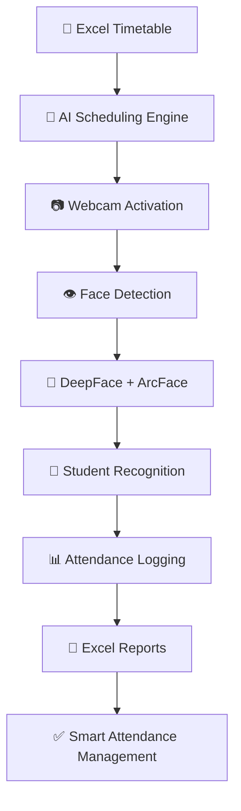

# Face-Recognition-Attendance-System
An Automated **Face Recognition Attendance System** built with Python, OpenCV, and DeepFace (ArcFace). The system detects and recognizes multiple faces in real time through a webcam and marks attendance automatically. It reads class schedules from Excel, activates during class time, and stores attendance records in CSV format.

<div align="center">

# 🎓 AI-Powered Smart Attendance Recording System  
### Hybrid Computer Vision & Data Synchronization Approach  


<br>


<br><br>


# 🚀 Smart • Automated • Intelligent

### Transforming Traditional Attendance into an AI-Driven Classroom Ecosystem

</div>

---

# 🌟 Overview  

This project presents a **Hybrid Computer Vision and Data Synchronization Approach to Smart Attendance Recording System** that automates classroom attendance using:

- 🧠 Artificial Intelligence
- 👁️ Computer Vision
- 🤖 Deep Learning
- 📊 Real-Time Data Synchronization
- 📅 Automated Timetable Integration

The system leverages **DeepFace with ArcFace** for highly accurate face recognition and automatically activates attendance sessions based on institutional class routines. :contentReference[oaicite:0]{index=0}

---

# ✨ Key Features  

<table>
<tr>
<td align="center" width="300">


## 👁️ Face Recognition

AI-powered student identification using:
- DeepFace
- ArcFace
- OpenCV

</td>

<td align="center" width="300">


## 📅 Smart Timetable Integration

Automatically:
- Detects current class
- Activates webcam
- Maps attendance to subjects

</td>

<td align="center" width="300">


## ⚡ Real-Time Attendance

Attendance marking:
- Live Recognition
- Automated Logging
- Subject-wise Records

</td>
</tr>
</table>

---

<table>
<tr>
<td align="center" width="300">


## 🧠 AI Automation

- Automated webcam scheduling
- Smart session handling
- Dynamic data synchronization

</td>

<td align="center" width="300">


## 📊 Excel-Based Reporting

Generates:
- Subject-wise attendance sheets
- Date-wise logs
- Attendance percentage

</td>

<td align="center" width="300">


## 👥 Multi-Face Recognition

Simultaneously detects:
- Multiple students
- Real-time identities
- Bounding boxes & labels

</td>
</tr>
</table>

---

# 🔥 Why This Project is Innovative?  

<div align="center">

| 🚀 Innovation | 🎯 Impact |
|---|---|
| Routine-Aware Attendance | Fully Automated Class Detection |
| DeepFace + ArcFace | High Recognition Accuracy |
| Edge-Based Processing | Low Latency & Privacy Protection |
| Real-Time Synchronization | Smart Administrative Workflow |
| Automated Webcam Scheduling | Resource Optimization |
| Subject-wise Excel Logging | Easy Academic Integration |

</div>

---

# 🛠️ 3D TECHNOLOGY STACK  

<div align="center">

# ⚡ Technologies Powering the System

</div>

---

<table>
<tr>
<td align="center" width="250">


# 🐍 Python

Core backend powering:
- AI logic
- Scheduling
- Automation
- Data synchronization

</td>

<td align="center" width="250">


# 👁️ OpenCV

Used for:
- Webcam capture
- Face detection
- Real-time frame processing
- Video handling

</td>

<td align="center" width="250">


# 🧠 Deep Learning

Powered by:
- DeepFace
- ArcFace
- CNN Architectures

</td>
</tr>
</table>

---

<table>
<tr>
<td align="center" width="250">


# ⚙️ Development Tools

- Git
- GitHub
- VS Code

</td>

<td align="center" width="250">


# 📊 Excel Integration

Used for:
- Timetable management
- Attendance storage
- Subject-wise records

</td>

<td align="center" width="250">


# ☁️ Smart Automation

- Real-time scheduling
- Automated session management
- Attendance synchronization

</td>
</tr>
</table>

---

# 🏗️ System Architecture  

<div align="center">



</div>

---

# ⚡ Working Workflow  

## 📌 Step-by-Step Process

```text
1️⃣ Load Student Face Database
        ↓
2️⃣ Read Excel Class Routine
        ↓
3️⃣ Detect Current Scheduled Class
        ↓
4️⃣ Activate Webcam Automatically
        ↓
5️⃣ Capture Student Faces
        ↓
6️⃣ DeepFace + ArcFace Recognition
        ↓
7️⃣ Mark Attendance Automatically
        ↓
8️⃣ Generate Excel Attendance Reports
```

---

# 📂 Project Structure  

```bash
Smart-Attendance-System/
│
├── app.py
├── requirements.txt
├── README.md
│
├── images_data/
│
├── attendance_sheets/
│
├── models/
│
├── routine/
│   └── class_routine.xlsx
│
├── modules/
│   ├── face_recognition/
│   ├── attendance/
│   ├── scheduling/
│   └── reporting/
│
└── assets/
```

---

# ⚡ Installation Guide  

## Clone Repository

```bash
git clone https://github.com/your-username/Smart-Attendance-System.git
```

---

## Navigate to Project Directory

```bash
cd Smart-Attendance-System
```

---

## Install Dependencies

```bash
pip install -r requirements.txt
```

---

## Run the System

```bash
python app.py
```

---

# 📊 Experimental Results  

<div align="center">

| 📈 Metric | ✅ Performance |
|---|---|
| Recognition Accuracy | 97% |
| Multiple Face Detection | Up to 5 Students |
| Average Latency | 0.5s – 1.2s |
| Real-Time Attendance | Successful |
| Automated Scheduling | Enabled |

</div>

The system demonstrated high robustness under varying classroom conditions and lighting environments.

---

# 🌍 Real-World Impact  

✅ Eliminates manual attendance errors  
✅ Reduces administrative workload  
✅ Contactless & hygienic attendance  
✅ Smart classroom automation  
✅ Real-time attendance synchronization  
✅ Transparent attendance management  
✅ Scalable for educational institutions  

---

# 🔮 Future Scope  

<div align="center">

| 🚀 Future Enhancement | 🎯 Purpose |
|---|---|
| ☁️ Cloud Synchronization | Centralized Attendance |
| 👀 Attentiveness Tracking | Student Engagement Analysis |
| 📱 Mobile Application | Easy Accessibility |
| 🛰️ Multi-Camera Integration | Large Classroom Support |
| 🌙 Infrared Camera Support | Low-Light Recognition |
| 📊 AI Analytics Dashboard | Smart Performance Insights |

</div>

---

# 👨‍💻 Authors  

<div align="center">

## Developed By

### 👩‍💻 Rupsha Biswas  
### 👨‍💻 Sayan Das  

</div>

---

# 📜 Research Paper  

📄 **A Hybrid Computer Vision and Data Synchronization Approach to Smart Attendance Recording System** :contentReference[oaicite:2]{index=2}

---

# 📜 License  

This project is licensed under the MIT License.

---

# 🌟 Final Vision  

<div align="center">

# 🎓 Intelligent Classrooms Begin Here

### AI • Automation • Smart Attendance • Real-Time Recognition


</div>
